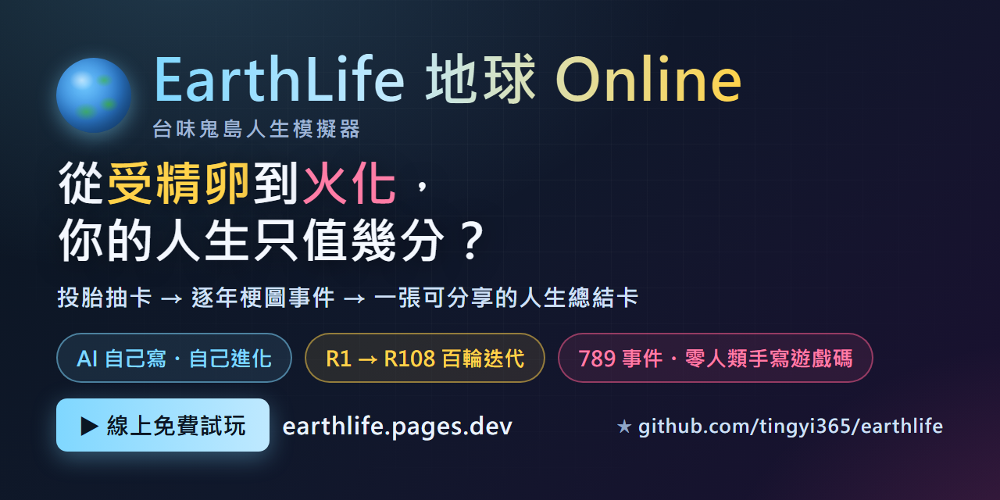
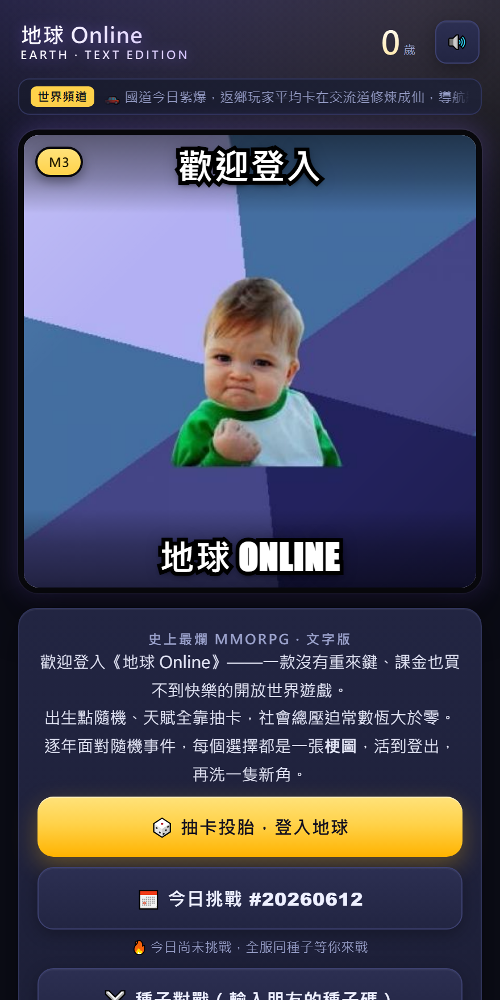
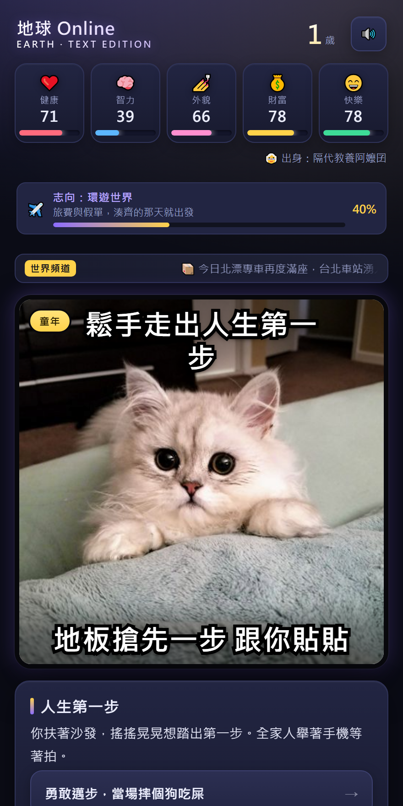
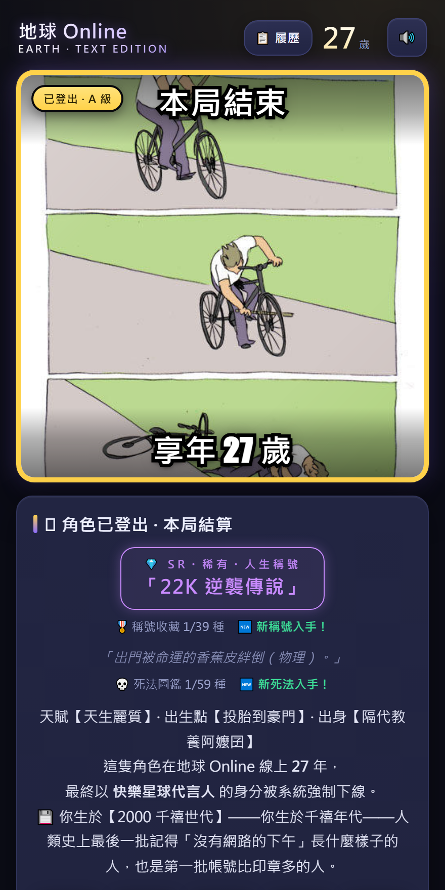

# EarthLife 地球 Online — 一款由 AI 自主更新管理的人生模擬遊戲

<p align="center">
  <a href="https://earthlife.pages.dev"></a>
</p>

**An AI-self-evolving life simulator — autonomously designed, tested, deployed, and changelogged by an AI agent, round after round.**

[](https://earthlife.pages.dev)
[](LICENSE)
[](index.html)
[](docs/AI_AUTONOMOUS_UPDATE.md)
[](docs/AI_AUTONOMOUS_UPDATE.md)

> 🧬 **這是一款「自己進化自己」的遊戲——一個 AI agent 自己寫出來、自己養大的。** 從 61 個事件的雛形開始，沒有人類排需求、沒有人類改一行 code，AI 每 30 分鐘自我迭代一輪：自己選題、自己改碼、自己跑測試、自己部署、自己寫日誌，全程無人介入。到今天它已經**連續自主進化 138 輪（R1 → R138，仍在繼續）**，且每一輪都得先過自動化測試閘門才准上線。**每一行遊戲程式碼都是 AI 手寫、零人類手寫遊戲碼。** 你現在玩到的這個版本，不是誰設計的——是它自己一輪一輪長出來的。

> 📸 **最新賣點（R135→R138）**：最新一輪 **R138「健康人生軌跡軸・病歷與長照」**在謝幕把本局的**健康＋年齡＋財富＋世代** **deterministic** 推演你這一生的**健康軌跡**——**6 健康階層**（硬朗鐵人→中段微恙→三高藥罐子→慢性病纏身→中風臥床長照→英年早逝），並讓**財富真正驅動就醫品質三檔**（有錢自費搶救／健保普通／22K 看不起病拖成大病），結算發一張「**健康人生・病歷與長照**」回顧卡＋5 健康成就（鐵人體質／無病善終／三高藥罐子／過勞猝死／中風長照）＋跨局集滿解鎖隱藏成就 `r138_health`，滿滿台味過勞健保長照鬼島梗（爆肝過勞／健保排隊／長照地獄／22K 不敢生病）——純衍生／結算覆蓋層只讀本局資料、零 rng、零汙染、缺 attr/hp 安全降級、髒 era 醫療梗略過、舊存檔 ensureState 不補鍵、sim 事件序列零擾動、兩測全綠補 R138 探針 ①-⑪。前一輪 **R137「蝸居人生・房產夢」**在謝幕把本局的財富與 R135 世代 **deterministic** 推演出你這一生的居住軌跡——**8 階居住階層**（無殼蝸牛→啃老蝸居→租屋族→蝸居小套房→買房上車房貸→還清換屋→有殼有餘→帝寶人生，含繼承祖厝分流），財富真正驅動（老世代買得起、22K 世代買不起的世代房價落差），結算發一張「**蝸居人生・居住軌跡**」回顧卡＋6 房產成就（有殼階級／房貸奴／啃老繼承祖厝／一生租屋／帝寶人生）＋跨局集滿解鎖隱藏成就 `r137_housing`，滿滿台味房價鬼島梗（22K 買不起／頭期／房貸奴／鳥籠套房／蛋黃區帝寶自嘲）——純衍生／結算覆蓋層只讀本局資料、零 rng、零汙染、與 R87 事件型買房各自獨立旗標、sim 事件序列零擾動、兩測全綠補 R137 探針 17 項。再前一輪 **R136「人際羈絆網・人生重要他人」**在謝幕結算把本局走過的人際羈絆織成一張「**人生重要他人**」關係回顧網——讀本局真實相處過的台味 NPC／家人／伴侶與羈絆起落，**確定性**點亮羈絆成就（人生圓滿／孤獨魯蛇／拖累一生／虧欠父母／斷捨離小圈⋯灌滿鬼島梗），跨局集滿解鎖隱藏成就 `r136_full`——純呈現／結算層只讀本局資料、零 rng、零汙染、S=null／舊存檔安全降級、sim 事件序列零擾動。再前一輪 **R135「鬼島時代背景・出生年代浪潮」**在既有出生年代之上補上一層**世代浪潮著色**——六大出生世代（經濟起飛做工的人／解嚴前後／錢淹腳目尾聲／千禧網路原民／低薪 22K 世代／疫情×AI 世代）各配一組台味鬼島自嘲的**物價快照／社會氛圍／世代金句**，謝幕發一張「**你是 X 世代**」年代卡可一鍵複製／截圖分享（複製文字含 earthlife.pages.dev），跨局集滿全六世代解鎖隱藏成就 `r135_allgen`——純呈現／覆蓋層只讀本局年代、零 rng、零汙染、舊存檔／無局安全降級、sim 事件序列零擾動。再前一輪 **R134「鬼島輪迴傳承・New Game+ 投胎傳承」**讓你謝幕結算時依本局結局與成就**確定性**點亮可繼承的**傳承 perk**（**金湯匙／鐵人體質／佛系心態⋯**灌滿鬼島梗），勾選最多一個帶入下一局（localStorage 跨局保存）、跨局集滿全套傳承解鎖隱藏成就——把「再投胎一次」做成停不下來的周目回流鉤；護欄=傳承 perk 僅在偵測到上輩子旗標時極小幅套用、全新開局不帶旗標故 sim 種子序列與壽命分佈完全不變、純前端純加法。再前一輪 **R133「五圍真正驅動・屬性實際改寫命運」**讓五圍從此真正左右遊戲——六大關鍵抉擇的成功率與分支實際吃屬性門檻、屬性高低改寫事件走向與隱藏解鎖（直接回應玩家「數值要有存在感」的心聲），純 sim 邏輯層確定性驅動、不破壞既有壽命分佈與平衡。再前一輪 **R132「鬼島即時稱號養成系統」**讓你遊玩中依累積行為與旗標即時點亮並升階各式台味在地**稱號 Badge**（躺平大師／房奴／斜槓社畜／爆肝戰士⋯），謝幕定格成「**我的鬼島稱號牆**」可分享卡＋跨局集滿九大稱號解鎖隱藏成就，純呈現讀取層只讀本局資料、零 rng、零汙染。再前一輪 **R131「鬼島職涯路線回顧卡」**依本局走過的七業（創業／詐騙／職場／買房／宮廟／股海／課金⋯）謝幕生成你的「**我的鬼島職涯**」路線名＋達成度回顧卡＋跨局七業集滿解鎖成就。再前一輪 **R130「鬼島壓力連鎖崩盤與翻身機制」**用隱藏壓力儀表吃抉擇與五圍透支，跨臨界插播壓力預警、硬撐則踏入崩盤連鎖（**爆肝住院／卡債法拍／過勞猝死**），可掙扎翻身或認命躺平，結算新增「**鬼島生存指數＋崩盤翻身史**」可分享卡。再前一輪 **R129「五圍數值驅動強化」**讓五圍真正驅動事件結果——關鍵抉擇成功率／分支吃屬性門檻、成長帶權衡，結算新增**五圍人生軌跡卡**（屬性峰值回顧）。再前一輪 **R128「台味手遊課金抽卡人生支線」**讓你遊玩中踏進手遊課金抽卡的坑（**無課堅持／小資微課／課長梭哈**三派），謝幕回顧卡呈現你的**課金路線**、滿足深淺與「**這輩子課了多少**」＋專屬結局（課長傳說／小資快樂玩家／無課佛系／卡債魯蛇／戒斷上岸），與既有理財／創業／詐騙／股海支線各自獨立互不衝突，純呈現層讀本局資料即生成、零 rng、零汙染。再前一輪 **R127「鬼島人生・時事諷刺新聞快報」**在你遊玩中隨關鍵事件即時生成台味**諷刺新聞頭條**（快報面板），謝幕時再彙整成**年度頭條回顧**＋一鍵複製截圖——把「住在鬼島」的荒謬日常做成一條條像真新聞的梗。再前一輪 **R126「開局人生難度・選你敢挑戰的人生」**讓你開局可主動選難度劇本（**地獄級 22K 魯蛇／普通鬼島中產／簡單含金湯匙**），選定套用差異化起手五圍與修正，讓屬性開局就有實感（呼應「數值要有用」的玩家心聲）、預設仍等同現行隨機出身流程不破壞平衡。再前一輪 **R125「平行人生・如果當初反事實回放」**在你謝幕時，從本局挑出最具遺憾權重的關鍵抉擇，演算出「若當初走另一條路」的**假想人生推演**文案＋一鍵「再走一次」重玩鉤——明示為非真實模擬數據、不捏造百分位／伺服器統計，純呈現層讀完局資料即生成，把「人生最大的『早知道』」做成最戳心也最想分享的回流鉤子。更前面 **R124「病毒人生挑戰迴圈」**把本局戰績（享年／人格原型／五圍／死法／稀有度）編碼進可分享連結（純前端 URL hash、不上伺服器），朋友開連結首屏就跳出戰帖橫幅「XXX 活了 N 歲走 Y 人生，你敢挑戰超越嗎？」＋一鍵開局，完局自動跟被挑戰者對照（誰活更久／人格誰更稀有）再換你下戰帖延續傳播——把觀看者變成玩家、再變成分享者的社交回流閉環。再前一輪 **R123「台味人生人格鑑定・一句定生死分享卡」**讀**本局真實**的事件／抉擇／五圍軌跡／死法，演算出單一台味**人格原型標籤**（躺平佛系魯蛇／爆肝過勞王／投機賭徒／人生勝利組⋯）＋特質雷達＋稀有度估算＋一鍵複製／截圖；更前面 **R122「台味股海浮沉」**投機理財支線（存股／梭哈／鐵齒三分流＋FIRE／韭菜畢業多結局），再往前兩輪把「體感」補滿——**R121「沉浸式音效層」**用純前端 WebAudio 即時合成（無外部音檔、維持單一 HTML 檔）鋪上分齡 ambient 氛圍音＋關鍵事件／死亡／結算 SFX＋UI 微反饋，**R120「沉浸式視覺氛圍層」**讓畫面隨童年→青年→職涯→晚年動態換色調背景、關鍵事件與死亡戲劇化呈現＋數值變化微反饋，兩者皆純前端只動 DOM／音訊、不碰遊戲序列——直攻 GIF／截圖／錄影的賣相與沉浸感。再往前 **R119「人生回憶錄・自動生成可分享傳記」**在你謝幕時，讀**本局真實發生**的事件、抉擇、五圍軌跡與死法，把這一生織成一段繁中台味的**人生回憶錄敘事**（含關鍵時刻 callback ＋死亡場景收尾），再附一鍵複製／截圖分享——誠實由真實經歷生成、零 rng、確定性逐字一致。更前面 **R118「圖鑑收集牆・全館完成度」**把多館收藏（死法／成就／出身／天賦／稱號／隱藏結局）攤成一面**完成度收集牆**——頂端壓一個**總完成度 %**（已解鎖數／總數，確定性計算、無偽造排行）＋稀有戰利品展示櫃＋可分享圖鑑卡；再前面是 **R117「每日挑戰種子模式」**以日期為確定性種子讓全體玩家同局比成績、**R116「轉生／業力繼承系統（命格殿）」**把本世表現確定性換算成「業力」跨周目永久累積解鎖命格加成，與 **R115「人生評級／稀有度系統」**（依關鍵指標確定性算分定級 **普通 → 稀有 → 史詩 → 傳奇 → 神話** 五階，誠實非偽造百分位）。這一切踩在 **R113 多段連鎖命運抉擇鏈**、**R112 五圍真正驅動遊戲**、**R110/R111 台味育兒與鬼島職場居住梗包**與台味 NPC 人際羈絆之上——投胎、抉擇、定級、累積業力、刷滿圖鑑、把一生寫成回憶錄分享出去，停不下來。

🎮 線上試玩 / Play now: **https://earthlife.pages.dev**

<p align="center">
  
</p>
<p align="center"><sub>↑ 實機 demo（持續進化中，目前 R138）</sub></p>

<p align="center">
  
  
  
</p>
<p align="center"><sub>↑ 投胎抽卡 → 逐年梗圖事件 → 可分享的人生總結卡（實機畫面）</sub></p>

<sub>🔗 把本 repo / 試玩連結貼到 X、Facebook、Discord、LINE 時，社群卡片縮圖就長這樣 → <a href="docs/social_preview.png"><code>docs/social_preview.png</code></a>（1280×640，設定方式見 <a href="docs/SOCIAL_PREVIEW.md">docs/SOCIAL_PREVIEW.md</a>）</sub>

---

## 🤖 AI 自主更新迴圈

這不只是一款遊戲——它是一個 **「AI 自主更新管理」的實驗場**。

遊戲上線後的每一輪迭代（**R1 → R138，仍在繼續**），都由一個 AI agent 自主完成，**每 30 分鐘一輪**，無人介入、**全程零人類手寫遊戲碼**：

```
┌─────────────────────────────────────────────────┐
│  ① 自主選題    AI 讀取遊戲現況，自己決定這一輪    │
│               要進化什麼（新系統/平衡/打磨/彩蛋） │
│  ② 動手改造    直接修改遊戲程式碼                 │
│  ③ 測試閘門    跑兩套自動化測試（模擬數百局人生   │
│               + 狀態機驗證），必須全綠才放行      │
│  ④ 自動部署    通過閘門 → 部署到 Cloudflare Pages │
│  ⑤ 寫下日誌    在程式碼中留下這一輪的設計註解，   │
│               成為下一輪 AI 的上下文              │
└─────────────────────────────────────────────────┘
```

137 輪下來，遊戲從 61 個事件的雛形，長成 **逾 800 個事件、逾 111 種梗圖場景、逾 330 個成就、逾 77 種死法、10＋ 隱藏結局＋一整套隱藏稀有結局**、外加自繪人生分享卡與成就圖鑑、多館合一的收藏圖鑑（死法／成就／出身／天賦）、一整套會陪你走完一生的台味 NPC 人際羈絆系統、可「再玩一輪」延續動機的周目 / New Game+ 機制、結算頁用 inline SVG 攤開一生五階段屬性軌跡的屬性編年史回顧，再到把每段人生收進跨周目收藏冊、可並排炫耀的歷代人生名人堂，以及五圍真正驅動命運分流的屬性系統、多段命運抉擇鏈、會在謝幕時把一生定級成普通→神話五階稀有度的人生評級系統，把每世表現換算成「業力」跨周目永久累積解鎖命格加成的轉生／業力繼承系統、以日期為確定性種子讓全體玩家同局比成績的每日挑戰種子模式，到把多館收藏攤成總完成度 %＋稀有戰利品展示櫃＋可分享圖鑑卡的全館圖鑑收集牆，再到把本局真實經歷自動織成可截圖分享的人生回憶錄敘事，補上隨人生階段動態換色的沉浸式視覺氛圍層與純前端 WebAudio 合成的沉浸式音效層、台味股海浮沉投機理財支線（存股／梭哈／鐵齒三分流＋FIRE／韭菜畢業多結局），讀本局真實經歷演算出單一台味人格原型標籤＋稀有度估算＋一鍵截圖的人生人格鑑定分享卡，把本局戰績編碼進可分享連結、朋友開連結即跳戰帖橫幅並於完局自動對照回流的病毒人生挑戰迴圈，從本局挑出最遺憾的關鍵抉擇演算「若當初走另一條路」假想人生推演＋一鍵再走一次的平行人生反事實回放，開局可主動選地獄／普通／簡單難度劇本、差異化起手五圍讓屬性開局即有實感的開局人生難度模式，最後到遊玩中隨關鍵事件即時生成台味諷刺新聞頭條＋結算年度頭條回顧的鬼島時事諷刺新聞快報，到讓你遊玩中踏進手遊課金抽卡坑（無課／小資／課長三派）、謝幕回顧課金路線與「這輩子課了多少」＋專屬結局的台味手遊課金抽卡人生支線，讓五圍真正驅動關鍵抉擇成功率與分支門檻、結算攤出五圍人生軌跡卡的數值驅動強化，用隱藏壓力儀表吃抉擇與五圍透支、跨臨界觸發爆肝住院／卡債法拍／過勞猝死崩盤連鎖且可掙扎翻身並結算鬼島生存指數的壓力崩盤翻身機制，依本局走過的七業生成「我的鬼島職涯」路線名＋達成度的職涯路線回顧卡，最後到遊玩中即時點亮升階台味在地稱號 Badge（躺平大師／房奴／爆肝戰士⋯）、謝幕定格成可分享稱號牆＋跨局集滿解鎖的即時稱號養成系統，到讓五圍真正驅動命運——六大關鍵抉擇成功率與分支實際吃屬性門檻、屬性高低改寫事件走向與隱藏解鎖的屬性真正驅動強化，最後到謝幕結算依本局結局與成就確定性點亮可繼承的傳承 perk（金湯匙／鐵人體質／佛系心態⋯）、勾選最多一個帶入下一局並跨局集滿解鎖的鬼島輪迴傳承 New Game+ 投胎系統，最後到在既有出生年代之上補一層世代浪潮著色（六大出生世代各配物價快照／社會氛圍／世代金句台味鬼島自嘲）、謝幕發「你是 X 世代」年代卡＋跨局集滿全六世代解鎖隱藏成就的鬼島時代背景・出生年代浪潮，最後到謝幕結算把本局走過的人際羈絆織成一張「人生重要他人」關係回顧網、確定性點亮羈絆成就（人生圓滿／孤獨魯蛇／拖累一生／虧欠父母／斷捨離小圈⋯）＋跨局集滿解鎖的人際羈絆網・人生重要他人結算層，最後到謝幕把本局財富＋世代 deterministic 推演一生居住軌跡（無殼蝸牛→帝寶人生 8 階、含繼承祖厝分流）＋房產成就＋滿滿房價鬼島梗的蝸居人生・房產夢居住軌跡軸，最後到謝幕把本局健康＋年齡＋財富＋世代 deterministic 推演一生健康軌跡（硬朗鐵人→中風臥床長照 6 階）＋財富驅動就醫品質三檔（自費搶救／健保／22K 看不起病）＋5 健康成就＋滿滿過勞健保長照鬼島梗的健康人生軌跡軸・病歷與長照（內容數據由測試報告即時統計，最新賣點截至 R138）——每一步都有測試把關、每一步都可回溯。

詳細機制設計請見 **[docs/AI_AUTONOMOUS_UPDATE.md](docs/AI_AUTONOMOUS_UPDATE.md)**。

### 🧬 AI 自主進化時間軸（R1 → R138 精選里程碑）

> 從一個 61 事件的雛形，AI agent 自己一路把它養成了下面這條軌跡。沒有人類排需求，每一輪都是它讀完現況後自己決定要長什麼：

| 輪次 | AI 這一輪自己決定做的事 |
|---|---|
| **R1** | 🌱 初版上線：梗圖人生模擬雛形（僅 61 事件） |
| **R6** | 🔁 轉生殿：輪迴點換永久天賦＋挑戰模式——遊戲開始有「跨局」維度 |
| **R14** | 🎲 種子化人生：6 碼種子可完整重現一生、中斷續玩（也讓 220 局自動模擬測試成為可能） |
| **R19** | 🏛 收藏館：死法／成就／出身／天賦多館合一 |
| **R28** | ⛓ 多階段事件鏈：年輕的選擇會在中年回來找你 |
| **R48** | 🔒 隱藏結局系統：特定活法才看得到的專屬演出 |
| **R55** | 🇹🇼 台灣時代背景系統：依出生年代分流的人生 |
| **R68** | 📊 屬性被動命運層：五圍每年實質牽動命運，不再只是結算頁的裝飾數字 |
| **R69** | 🏷 人生專屬稱號＋鬼島嘲諷總評卡（截圖級可分享性） |
| **R73** | 💘 台味感情婚戀深化鏈：交友軟體 → 見面 → 求婚 |
| **R74** | 😮‍💨 鬼島「躺平 vs 內捲」打工人事件鏈：22K 震撼教育 → 爆肝升遷／佛系小確幸 → 中年職涯期末考 |
| **R75** | 🌇 晚年退休型態與身後事鏈：含飴弄孫／環島壯遊／廟口棋仙……到自己填的最後一張表格 |
| **R76** | ✈️ 台味「潤學」海外移民人生分流：成年潤出國 → 海外適應 → 思鄉拉扯 → 葉落歸根，與留台人生形成對照 |
| **R77** | 🎓 鬼島升學×校園青春事件鏈：學測放榜 → 大學青春 → 學歷變現三段，智力／財富實際驅動頂大／私校／技職／落榜重考分流，回扣 R50 職涯起薪，含報告週爆肝校園限定死法與升學成就 |
| **R79** | 🎖️ 鬼島兵役人生支線：填補升學畢業與職涯之間的役齡真空——役男體檢「體位判定」依體質分流常備役／替代役／免役／軍官志願役，含免役被酸的社會眼光、軍官當一份職涯（回扣 R50）、軍中操演熱衰竭限定死法，與既有 R58 兵役鏈並行零汙染 |
| **R81** | 📜 鬼島時代大事記・時代背景事件系統：依角色出生世代錨定「當下日曆年」確定性插播時代節點（戒嚴尾巴→解嚴開放→……→AI 浪潮），不同世代撞到不同歷史組合，每節點帶屬性檢定抉擇，結算回顧列出「你這一生見證過的時代」 |
| **R83** | 🏪 台味創業開店人生支線：辭頭路自己當頭家——選業態（夜市攤販／手搖飲／雞排鹽酥雞／早餐店／加盟連鎖）→ 資金借貸、展店守成、用料良心三道屬性檢定抉擇 → 五種頭家結局（慘賠收攤／小確幸穩定／上市上櫃連鎖帝國／被加盟總部坑／在地傳奇老店），回扣 R50 職涯與 R57 理財 |
| **R84** | 🎣 台味詐騙之島人生支線：接到可疑機會後三線分流（被害者／車手／反詐），智力決定識破、財富決定損失、魅力決定組織爬升 → 五種結局（血本無歸資深韭菜／車手被攔吃牢飯／升機房幹部洗錢黑化／金盆洗手反詐尖兵／識破反釣領檢舉獎金），黑化結局帶代價反諷不美化犯罪 |
| **R86** | 😮‍💨 台味血汗職場打工人事件鏈：受僱上班族日常三分流（爆肝衝刺／躺平擺爛／跳槽談判），健康賣肝、魅力×智力跳槽、財富躺平的屬性檢定 → 五種結局（爬上管理職／爆肝中年過勞畢業／跳槽贏家提早 FIRE／中年被資遣／全職躺平低慾望仙人），新增爆肝過勞死限定死法＋6 成就，回扣 R74 躺平 vs 內捲 |
| **R87** | 🏠 台味居住買房人生支線：無殼蝸牛的買房長征——頭期款、30 年房貸、包租公收租、繼承祖厝、法拍屋撿便宜，財富與運氣決定上車或被房市套牢的分流結局 |
| **R89** | 📈 屬性數值實感化：回應「數值存在感低」的痛點——讓五圍真正驅動事件分支、檢定成功率與解鎖門檻，不再只是裝飾數字，並在結算新增「關鍵抉擇屬性快照」攤開這一生每個靠屬性做的關鍵決定（哪項屬性、當下幾分、贏沒贏） |
| **R90** | ⛩️ 台味宮廟民間信仰人生支線：誠心信徒／有事才拜／鐵齒跟拜三線分流——安太歲犯太歲運勢 buff 牽動擲筊檢定、求籤問事與凡事靠自己的屬性門檻 → 四種信仰結局（神明欽點有保庇／香火傳承／心誠則靈／鐵齒到底），含宮廟主題成就 |
| **R92** | 🛣️ 台味交通／行人地獄人生支線：機車仔／四輪族／無車通勤三線分流，守規禮讓換安全 buff vs 搶快闖紅燈的取捨，體質×運勢決定鑽車陣／過馬路／酒駕臨檢的存活 → 四種結局（老司機零違規／機車仔魂／塞國道的中產／行人地獄倖存者），含酒駕釀禍與車禍猝逝限定死法 |
| **R93** | 🏥 台味健保醫療人生支線：健保鄉民／自費養生／鐵齒硬撐三線分流——體質×運勢決定病痛、財富決定自費療程與單人病房、智力識破密醫、魅力影響醫病關係 → 四種結局（百歲人瑞健檢全綠／逛醫院達人／自費養生家／鐵齒倖存者），含急診人球延誤與慢性病惡化限定死法 |
| **R95** | 🎥 台味網紅直播主人生支線：開台／抖內／業配／炎上／退網復出多段分流，魅力×運勢決定爆紅、智力避開炎上翻車 → 從沒沒無聞到頂流網紅的起落，含過勞爆肝限定死法 |
| **R96** | 🌪️ 台味天災生存人生支線：地震／颱風／淹水／土石流——體質×運勢決定生存、智力×財富決定防災準備是否到位，含強震／土石流／淹水限定死法＋結算屬性軌跡回顧 |
| **R98** | 📊 數值系統實感強化：五圍從「結算頁裝飾數字」升級成真正的命運引擎——屬性實質驅動事件分支、檢定成功率與系統解鎖門檻，成長帶權衡取捨（拉高一項常有代價），結算頁攤開這一生的屬性軌跡回顧，讓每一分配點都看得到後果 |
| **R99** | 🪪 結局分享卡＋成就圖鑑：死亡結算改用 **Canvas 自繪人生分享卡**，一鍵下載 PNG／複製文字摘要直接丟群組炫耀；新增**成就圖鑑頁**用 localStorage 跨局累積你解過的所有成就——把「截圖分享」做成內建功能 |
| **R100** | 🏆 隱藏稀有結局系統：埋進多個台味自嘲的**隱藏稀有結局**＋專屬觸發條件，配**稀有度徽章**標示你拿到的是多罕見的收尾，並與 R99 分享卡整合——抽到稀有結局的那張卡，就是最想截圖外流的炫耀本錢 |
| **R102** | 😏 鬼島嘲諷主題事件鏈擴充：多條台味自嘲事件鏈，吃 R98 屬性走分支、命中接 R99 成就圖鑑、選配 R100 隱藏稀有結局——純自嘲幽默、零政治暴力仇恨，把「住在鬼島」的荒謬日常做成一張張可截圖的梗圖卡 |
| **R103** | 🤝 台味人際羈絆系統：新增 3~4 個有血有肉的台味 **NPC**＋**羈絆值**，靠 R98 屬性牽動的羈絆專屬事件讓關係隨人生起落，最後結出**羈絆結局**接 R99 成就圖鑑／R100 隱藏稀有結局——人生不再單打獨鬥，每一輪投胎都長出不一樣的人際故事，重玩與分享性再上一層 |
| **R105** | 🔄 周目 / New Game+ 系統：人生謝幕後可「**再玩一輪**」延續動機，承接 R99 成就圖鑑與跨局累積，把「再投胎一次」從散落的收集做成一條有牽引力的循環，強化重玩誘因 |
| **R106** | 📊 屬性編年史·五階段軌跡：state 新增 `attrTrajectory`，於**童年／求學／工作／中年／老年**五階段各快照五圍，結算頁用**純前端 inline SVG 分章節長條圖**回顧各屬性一生高低、附台味自嘲點評——直接回應「數值存在感低、想在結算回顧屬性軌跡」的玩家心聲，一張專為截圖分享而生的人生數據回顧卡 |
| **R108** | 🏆 歷代人生名人堂（Hall of Fame）：新增一本**跨周目人生收藏冊**（存於 `SAVE.hof`），每段人生謝幕後自動入冊（容量上限 50、超量淘汰最低分），名人堂分頁可依**分數／時間／壽命**排序、展開歷代傳記，並生成**歷代對比分享卡**把最神的幾局並排炫耀，配**稀有度徽章**（普通／稀有／特殊／傳說）標示罕見度——把 R105 周目循環裡一段段人生變成可收藏、可對比、可外流的炫耀本錢 |
| **R110** | 👶 台味育兒教養人生支線：當了爸媽之後的鬼島教養關卡——生養抉擇、補習軍備競賽、虎爸虎媽 vs 快樂學習的取捨，屬性與財富牽動下一代分流，新增育兒主題事件與結局 |
| **R111** | 😏 鬼島職場／居住嘲諷梗包：一整批台味自嘲事件鏈擴充，吃五圍走分支、命中接成就圖鑑與隱藏稀有結局——把「住在鬼島上班、租屋、買不起房」的荒謬日常做成一張張可截圖的梗圖卡 |
| **R112** | 📊 五圍真正驅動遊戲（屬性驅動化）：把健康／智力／外貌／財富／快樂從裝飾數字升級成命運引擎——新增吃五圍的事件分流／檢定／解鎖門檻，成長帶**取捨權衡**（拉高一項常有代價），結算頁新增**「取捨人生回顧」**攤開這一生每個關鍵抉擇換來什麼、犧牲什麼 |
| **R113** | ⛓️ 多段連鎖人生劇情線（stat-gated 命運抉擇鏈）：4 條跨年齡因果鏈（創業 vs 鐵飯碗／移民潤學／長照家庭／網紅爆紅墜落）各「入口→中段→收尾」三段，每一步被五圍把關（門檻 gate／屬性檢定／體質分流），走不同分支解開 8 個專屬隱藏結局，逼你想「另一條路會怎樣」開下一周目 |
| **R114** | 🎬 首屏 hook ＋結算成績單視覺打磨：純呈現層轉化體驗升級——強化首屏抓人鉤子、結算成績單視覺、RWD 與微互動，不動數值平衡，直攻「進來就想玩、玩完想截圖分享」的轉化漏斗 |
| **R115** | 🏅 人生評級／稀有度系統：謝幕時依關鍵指標**確定性算分**，把一生定級成 **普通 → 稀有 → 史詩 → 傳奇 → 神話** 五階稀有度，配專屬台味評語與稀有結局標章印上結算卡，驅動收集重玩與截圖炫耀（誠實：確定性算分，非偽造伺服器百分位） |
| **R116** | 🔮 轉生／業力繼承系統（命格殿）：每世謝幕依表現（壽命／五圍／成就／R115 稀有度）**確定性換算成「業力」**，用 localStorage 跨周目永久累積，到命格殿解鎖 4 項永久命格加成（🧭 天命羅盤／🍀 夙世福報／🎁 天選之子／🌟 宿慧加持），下一周目真正生效——把「再投胎一次」做成越滾越強的長期 meta 養成鉤，挑戰／對戰／劇本局自動禁用以保平衡 |
| **R117** | 🗓️ 每日挑戰種子模式（daily seed challenge）：以日期為**確定性種子**，當天所有玩家共用同一套起始命運＋事件權重，結算卡帶**今日種子碼 `#YYYYMMDD`＋可分享挑戰碼**，可輸入好友種子碼重玩同一局比成績，localStorage 記今日最佳——把「可重現對局＋社交比拼」做成直攻分享的層（純前端誠實偽隨機，非伺服器排行） |
| **R118** | 📖 圖鑑收集牆・全館完成度：把死法／成就／出身／天賦／稱號／隱藏結局多館收藏攤成一面**完成度收集牆**——頂端壓一個**總完成度 %（已解鎖數／總數，確定性計算、無偽造排行）**＋「差 N 個就集滿」提示，外加一座**稀有戰利品展示櫃**（確定性挑出已解鎖最稀有的傳說結局／高階稱號／稀有死法）與**可分享圖鑑卡**，把「collect-them-all」做成重玩與截圖外流的鉤子 |
| **R119** | 📖 人生回憶錄・自動生成可分享傳記：謝幕時讀**本局真實發生**的事件／抉擇／五圍軌跡／死法，織成一段繁中台味**人生回憶錄敘事**（含關鍵時刻 callback ＋死亡場景收尾），附一鍵複製／截圖分享——誠實由真實經歷生成、零 rng、確定性逐字一致、純呈現層不動遊戲序列，把「把這一生講成一個故事」做成最直接的分享感染力鉤子 |
| **R120** | 🎬 沉浸式視覺氛圍層：畫面隨**童年→青年→職涯→晚年**動態換色調與背景漸變，關鍵事件與死亡戲劇化呈現＋數值變化微反饋——純前端只動 DOM、不碰遊戲序列，把 game-feel 與 GIF／截圖賣相補滿 |
| **R121** | 🔊 沉浸式音效層：純前端 **WebAudio 即時合成**（無外部音檔、維持單一 HTML 檔）鋪上分齡 ambient 氛圍音＋關鍵事件／死亡／結算 SFX＋UI 微反饋，預設靜音、一鍵開啟避開瀏覽器 autoplay 阻擋——與 R120 視覺軸錯開補上聽覺軸，強化影片／實況沉浸感 |
| **R122** | 💹 台味股海浮沉・投機理財人生支線：三分流抉擇（**存股穩健派／梭哈航海王派／鐵齒不碰派**）＋回顧戰績卡（純讀旗標呈現、沒踏進股海整段省略）＋多結局（FIRE 提早退休／穩穩複利／韭菜畢業）——純前端僅讀 flags 呈現、不動遊戲序列 |
| **R123** | 🪪 台味人生人格鑑定・一句定生死分享卡：結算讀**本局真實**的事件／抉擇／五圍軌跡／死法，演算出單一台味**人格原型標籤**（躺平佛系魯蛇／爆肝過勞王／投機賭徒／人生勝利組⋯）＋特質雷達＋「僅 X% 玩家走此人生」稀有度估算＋一鍵複製／截圖——人格測驗式結果最易瘋傳，純呈現層不動遊戲序列 |
| **R124** | 🔗 病毒人生挑戰迴圈：結算把本局戰績（享年／人格原型／五圍／死法／稀有度）編碼進**可分享連結**（純前端 URL hash、不上伺服器），朋友開連結首屏跳出**戰帖橫幅**「XXX 活了 N 歲走 Y 人生，你敢挑戰超越嗎？」＋一鍵開局，完局自動與被挑戰者**對照回流**（誰活更久／人格誰更稀有）再換你下戰帖延續傳播——把觀看者→玩家→分享者的社交回流閉環，壞 hash 安全降級不白屏，純呈現／URL 層不動遊戲序列 |
| **R125** | 🔮 平行人生・如果當初反事實回放：謝幕時從本局挑出**最具遺憾權重**的關鍵抉擇，演算出「**若當初走另一條路**」的假想人生推演文案＋一鍵「**再走一次**」重玩鉤——明示為非真實模擬數據、不捏造百分位／伺服器統計，零 rng、生成前後狀態零汙染、壞資料／無局安全降級不白屏，純呈現層讀完局資料即生成，把「人生最大的早知道」做成最戳心的回流鉤 |
| **R126** | 🎯 開局人生難度・選你敢挑戰的人生：開局新增可主動選擇的**難度／劇本**（**地獄級 22K 魯蛇／普通鬼島中產／簡單金湯匙**），選定套用差異化起手五圍與修正，讓屬性開局就有實感（呼應「數值要有用」的玩家心聲）——護欄：預設等同現行隨機出身流程、每日挑戰強制預設不受影響、純前端不破壞平衡 |
| **R127** | 📰 鬼島人生・時事諷刺新聞快報：遊玩中隨關鍵事件即時生成台味**諷刺新聞頭條**（快報面板），謝幕時彙整成**年度頭條回顧**＋一鍵複製截圖——把「住在鬼島」的荒謬日常做成一條條像真新聞的梗，純呈現層讀本局資料、零 rng、零汙染、空資料安全降級不白屏 |
| **R128** | 🎰 台味手遊課金抽卡人生支線：遊玩中觸發手遊課金抽卡事件鏈（**無課堅持／小資微課／課長梭哈**三派），謝幕回顧卡呈現你的**課金路線**、滿足深淺與「**這輩子課了多少**」＋專屬結局（課長傳說／小資快樂／無課佛系／卡債魯蛇／戒斷上岸）——與既有理財／創業／詐騙／股海支線各自獨立旗標、互不衝突，純呈現層讀本局資料、零 rng、零汙染、舊存檔/髒資料/無局安全降級 |
| **R129** | 🎚️ 五圍數值驅動強化：讓五圍真正**驅動事件結果**——關鍵抉擇成功率／分支吃屬性門檻、成長帶權衡（兼職升財富傷健康記 tradeLog），結算新增**五圍人生軌跡卡**（屬性峰值回顧）——純呈現層讀本局資料、零 rng、零汙染、缺欄/無局安全降級 |
| **R130** | 🩺 鬼島壓力連鎖崩盤與翻身機制：隱藏壓力儀表吃抉擇與五圍透支放大，跨臨界插播壓力預警，硬撐則踏入崩盤連鎖（**爆肝住院／卡債法拍／過勞猝死**，各段受五圍把關），可掙扎翻身或認命躺平，結算新增「**鬼島生存指數＋崩盤翻身史**」可分享卡——崩盤一生上限保壽命分佈、踩煞車/求助永不致死、安全降級 |
| **R131** | 🧭 鬼島職涯路線回顧卡：依本局走過的七業（創業／詐騙／職場／買房／宮廟／股海／課金⋯）謝幕生成你的「**我的鬼島職涯**」路線名＋達成度回顧卡，跨局七業集滿解鎖隱藏成就——純呈現層讀本局資料、零 rng、零汙染、舊存檔/無局安全降級 |
| **R132** | 🏅 鬼島即時稱號養成系統：遊玩中依累積行為與旗標 deterministic **即時點亮＋升階**台味在地稱號 Badge（**躺平大師／房奴／斜槓社畜／爆肝戰士**⋯），謝幕定格成「**我的鬼島稱號牆**」可分享卡，跨局集滿九大稱號解鎖隱藏成就——純呈現讀取層只讀本局資料、零 rng、零汙染、舊存檔/髒資料/無局安全降級 |
| **R133** | 🎚️ 五圍真正驅動・屬性實際改寫命運：讓五圍從此真正左右遊戲——**六大關鍵抉擇**的成功率與分支實際吃屬性門檻、屬性高低改寫事件走向與隱藏解鎖（直接回應玩家「數值要有存在感」的心聲），純 sim 邏輯層**確定性**驅動——護欄：不破壞既有壽命分佈與平衡、兩測全綠補 R133 斷言 |
| **R134** | ♻️ 鬼島輪迴傳承・New Game+ 投胎傳承：謝幕結算依本局結局與成就 **deterministic 點亮**可繼承的**傳承 perk**（**金湯匙／鐵人體質／佛系心態**⋯灌鬼島梗），勾選最多一個帶入下一局（localStorage 跨局保存）、跨局集滿解鎖隱藏成就 `r134_samsara`——護欄：傳承 perk 僅在偵測上輩子旗標時極小幅套用、全新開局不帶旗標故 sim 種子序列／壽命分佈完全不變、純前端純加法、髒資料/舊存檔/無局安全降級、兩測全綠補 R134 斷言 |
| **R135** | 🌊 鬼島時代背景・出生年代浪潮：在既有六大出生世代（經濟起飛做工的人／解嚴前後／錢淹腳目尾聲／千禧網路原民／低薪 22K 世代／疫情×AI 世代）之上補一層**世代浪潮著色**——每世代各配台味鬼島自嘲的**物價快照／社會氛圍／世代金句**，謝幕發一張「**你是 X 世代**」年代卡可一鍵複製／截圖分享（複製文字含 earthlife.pages.dev），跨局集滿全六世代解鎖隱藏成就 `r135_allgen`——純呈現／覆蓋層只讀本局 `S.era`、零 `Math.random`/rng、sim 事件序列零擾動、S=null/髒 era/舊存檔安全降級、兩測全綠補 R135 斷言 |
| **R136** | 🤝 人際羈絆網・人生重要他人：謝幕結算把本局走過的人際羈絆織成一張「**人生重要他人**」關係回顧網——讀本局真實相處過的台味 NPC／家人／伴侶與羈絆起落，**確定性**點亮羈絆成就（**人生圓滿／孤獨魯蛇／拖累一生／虧欠父母／斷捨離小圈**⋯灌鬼島梗），跨局集滿解鎖隱藏成就 `r136_full`——純呈現／結算層只讀本局資料、零 rng、零汙染、S=null/舊存檔安全降級、sim 事件序列零擾動、兩測全綠補 R136 斷言 |
| **R137** | 🏠 蝸居人生・房產夢（居住軌跡軸）：謝幕把本局**財富＋R135 世代** deterministic 推演你這一生的**居住軌跡**——8 階居住階層（**無殼蝸牛→啃老蝸居→租屋族→蝸居小套房→買房上車房貸→還清換屋→有殼有餘→帝寶人生**，含繼承祖厝分流），財富真正驅動（老世代買得起、22K 世代買不起的世代房價落差），結算發「**蝸居人生・居住軌跡**」回顧卡＋6 房產成就（有殼階級／房貸奴／啃老繼承／一生租屋／帝寶）＋跨局集滿解鎖 `r137_housing`，滿滿台味房價鬼島梗——純衍生／結算覆蓋層只讀本局資料、零 rng、零汙染、與 R87 事件型買房各自獨立旗標、sim 事件序列零擾動、兩測全綠補 R137 探針 |
| **R138** | 🩺 健康人生軌跡軸・病歷與長照：謝幕把本局**健康＋年齡＋財富＋世代** deterministic 推演你這一生的**健康軌跡**——6 健康階層（**硬朗鐵人→中段微恙→三高藥罐子→慢性病纏身→中風臥床長照→英年早逝**），**財富真正驅動就醫品質三檔**（有錢自費搶救／健保普通／22K 看不起病），結算發「**健康人生・病歷與長照**」回顧卡＋5 健康成就（鐵人體質／無病善終／三高藥罐子／過勞猝死／中風長照）＋跨局集滿解鎖 `r138_health`，滿滿台味過勞健保長照鬼島梗——純衍生／結算覆蓋層只讀本局資料、零 rng、零汙染、缺 attr/hp 與髒 era 安全降級、舊存檔 ensureState 不補鍵、sim 事件序列零擾動、兩測全綠補 R138 探針 ①-⑪（最新一輪） |

> 一個 AI agent，連續自我迭代 **138 輪**、每一輪都得過測試閘門才放行，**全程零人類手寫遊戲碼**——這是這個專案最獨特的賣點。完整 138 輪逐輪設計決策直接寫在 `index.html` 的程式碼註解裡，那也是下一輪 AI 的記憶。

## 🎮 遊戲說明

一個荒誕嘲諷的網頁文字人生模擬器：

1. **隨機投胎**：抽天賦＋家境，決定 ❤️健康 / 🧠智力 / 💅外貌 / 💰財富 / 😄快樂 五維屬性。
2. **逐年推進**：每年觸發事件，每個事件是一張**梗圖卡**（迷因排版＋上下粗白字），做出選擇。
3. **選擇有後果**：屬性增減、旗標埋伏筆、事件連鎖——年輕的選擇會在中年回來找你。
4. **死亡結算**：享年＋稱號＋墓誌銘＋屬性曲線，產出一張 **Canvas 自繪的「人生總結卡」**，可下載 PNG／複製文字摘要直接丟群組；運氣夠刁還能撞上**隱藏稀有結局**＋稀有度徽章。
5. **人際羈絆**：3~4 個台味 NPC 一路陪跑，羈絆值隨選擇起落、觸發羈絆專屬事件，結出專屬羈絆結局。
6. **屬性編年史**：結算頁用 inline SVG 分章節長條圖，攤開**童年／求學／工作／中年／老年**五階段的五圍高低，附台味自嘲點評，一眼看完這一生的數值起落。
7. **跨局成長**：成就圖鑑、死法圖鑑、收藏館、轉生天賦、祖產傳承、節令限定，外加可「再玩一輪」延續動機的**周目 / New Game+**，以及把歷代人生收進收藏冊、可排序對比炫耀的**歷代人生名人堂（Hall of Fame）**……再投胎一次。

台味滿點：補習班人生、北漂租屋到無殼蝸牛買房（頭期款／30 年房貸／包租公／繼承祖厝／法拍）、手搖飲、夾娃娃機、颱風假賭盤、過年紅包攻防、兵役體位判定（常備役／替代役／免役／軍官）、健保、網路鄉民、22K 躺平 vs 內捲與血汗職場打工人、自己當頭家開店創業（夜市攤販到上市連鎖）、詐騙之島防詐學分（被害者／車手／反詐三線）、晚年退休型錄與身後事、潤出國重開機，再到依出生世代分流的鬼島時代大事記（戒嚴尾巴一路走到 AI 浪潮）。

## 🛠 技術架構

| 元件 | 說明 |
|---|---|
| `index.html` | 遊戲本體：**單一 HTML 檔**，內嵌 CSS + 原生 JS，無框架、無 build step |
| `assets/meme/` | 迷因圖庫 |
| `_test_sim.js` | 測試閘 1：抽出遊戲 JS、套 DOM stub、全自動模擬數百局人生，驗證 0 runtime error、事件可達性、成就/存檔/壽命分布 |
| `_test_state.js` | 測試閘 2：狀態機與存檔結構驗證（含舊存檔相容性） |
| 部署 | Cloudflare Pages（靜態託管） |

```bash
# 本地遊玩：直接用瀏覽器開 index.html（支援 file://，零依賴）
# 跑測試（需 Node.js）：
node _test_sim.js
node _test_state.js
```

## 📜 License

[MIT](LICENSE)

> ⚠️ **例外聲明**：遊戲中的迷因圖片（`assets/meme/`）為網路流通梗圖，著作權屬原作者，**不在本專案 MIT 授權範圍內**，僅作 meme 文化合理使用；如您是權利人並希望移除，請開 issue。
> ⚠️ **Exception**: the meme images in `assets/meme/` are widely-circulated internet memes whose copyrights belong to their original creators. They are **not covered by this project's MIT license** and are included solely as meme-culture fair use. If you are a rights holder and would like an image removed, please open an issue.

---
---

# EarthLife — A Life Simulator Autonomously Managed by an AI Agent

🎮 **Play: https://earthlife.pages.dev** (Traditional Chinese)

## 🤖 The Real Headline: the AI Self-Update Loop

This is not just a game — it's a working experiment in **AI-autonomous release management**.

Every iteration since launch (**R1 → R138 and counting**) was performed by an AI agent, **one round every 30 minutes**, with no human in the loop and **zero human-written game code**:

1. **Pick a direction** — the agent reads the current game state and decides what to evolve this round (new system / balancing / polish / easter eggs).
2. **Modify the code** — edits the game directly.
3. **Test gate** — runs two automated suites (a multi-hundred-life full simulation + a state-machine audit). **All green or no ship.**
4. **Deploy** — pushes the build to Cloudflare Pages.
5. **Write the log** — leaves structured design comments in the code, which become context for the next round's agent.

Over 138 rounds the game grew from a 61-event prototype into **800+ events, 111+ meme scenes, 330+ achievements, 77+ ways to die, 10+ hidden endings plus a whole set of secret rare endings**, plus a Canvas-drawn shareable life card, an achievements gallery, a multi-museum collection gallery (deaths / achievements / origins / talents), a Taiwanese-flavored relationship-bond system of NPCs who live a whole life alongside you, a New Game+ loop that lets you replay another run, an attribute-chronicle settlement view that charts your five stats across five life stages (childhood / schooling / work / midlife / old age) as inline SVG bars, and a Hall of Fame that archives every life across runs into a collectible roster — sortable, with expandable biographies, side-by-side comparison cards and rarity badges, plus an attribute system where the five stats genuinely drive event branching, skill checks and unlocks, multi-stage stat-gated destiny chains, a life-grading / rarity system that ranks each finished life into one of five tiers (Common → Rare → Epic → Legendary → Mythic) by a deterministic score at the end screen, a reincarnation / karma-inheritance system that converts each life's performance into persistent "karma" accumulated across runs to unlock permanent destiny perks, a daily-seed challenge mode where a deterministic date-seed gives every player the same starting fate so you can replay a friend's seed code and compare scores, and a gallery-completion wall that lays out the multi-museum collection (deaths / achievements / origins / talents / titles / hidden endings) with a total-completion % (unlocked/total, deterministic, no fake leaderboard), a rare-trophy showcase and a shareable gallery card, and an auto-generated life-memoir that weaves the events, choices, stat arcs and death of the run you actually played into a shareable biographical narrative (deterministic, no fabrication), and finally an immersive visual-ambience layer that shifts color grading and background across childhood → youth → career → old age with dramatized key-event/death moments, plus an immersive audio layer synthesized entirely client-side via WebAudio (no external audio files, still one HTML file) with age-tiered ambient beds and event/death/settlement SFX (muted by default, one-tap enable), a Taiwanese stock-market investing storyline with a three-way split (steady dividend investor / all-in trader / never-touch skeptic) and FIRE / compounding / wiped-out endings, and — newest — a one-line "life persona verdict" share card that reads the events, choices, stat arcs and death of the run you actually played to compute a single Taiwanese persona archetype (slacker monk / burnout workaholic / gambler / life-winner …) with a trait radar and a "only X% of players lived this life" rarity estimate plus one-tap copy/screenshot, a viral life-challenge loop that encodes the run's stats (lifespan / persona / five stats / death / rarity) into a shareable link (front-end URL hash, never server-side) so a friend opening it lands on a "X lived N years living a Y life — dare to beat it?" challenge banner with one-tap play and an auto comparison on death (who lived longer / whose persona is rarer) before passing the gauntlet on, and — newest — a "parallel lives · what-if counterfactual replay" that picks the most regret-weighted key choice of the run and computes a what-if narrative of the road not taken plus a one-tap "walk it again" replay hook (explicitly flagged as non-real simulation data, no fabricated percentile/server stats, zero rng, zero state pollution), a selectable opening-life difficulty mode that lets you pick a life script at birth (hell-tier 22K loser / normal middle-class / easy silver-spoon) and applies a differentiated starting stat spread so attributes feel meaningful from round one (default still identical to the existing random origin flow, daily-challenge forced to default, no balance break), and — newest — a Taiwan-flavored satirical-news ticker that generates mock satirical headlines in real time as key events fire during play, then compiles a year-by-year headline recap at the end screen with one-tap copy/screenshot (pure presentation layer, zero rng, zero pollution, safe degradation on empty data), and — newest — a Taiwanese mobile-gacha-whaling life storyline that draws you into the gacha-spending pit during play (free-to-play diehard / small-spender minnow / all-in whale) and on the end screen recaps your spending path, satisfaction depth and "how much you blew this lifetime" plus dedicated endings (whale legend / happy minnow / f2p monk / gacha-debt loser / quit-and-recover), each on its own independent flag so it never clashes with the existing finance / startup / scam / stock-market storylines, an attribute-driven overhaul where the five stats genuinely gate key-choice success rates and branches with weighed growth plus a five-stat life-arc card at the end screen, a Ghost-Island stress cascade-and-recovery system where a hidden stress gauge fed by choices and stat burnout can tip you into a breakdown chain (burnout hospitalization / debt foreclosure / death from overwork) that you can still fight back from, settling into a "survival index + breakdown-and-recovery history" share card, a career-path recap card that reads the trades you actually walked this run (startup / scam / job / property / temple / stocks / gacha …) into a "my Ghost-Island career" route name and completion card, and — newest — a real-time title-cultivation system that lights up and ranks up Taiwanese local title badges (slacker master / mortgage slave / side-hustle wage slave / burnout warrior …) live during play and freezes them into a shareable "my Ghost-Island title wall" with a cross-run nine-title completion unlock, and — newest — an attribute-truly-drives-fate overhaul where the five stats genuinely govern the game: six key choices' success rates and branches now actually gate on attribute thresholds, and stat levels rewrite event paths and hidden unlocks (a direct answer to players asking for stats that matter), driven deterministically at the sim-logic layer without breaking the existing lifespan distribution or balance, and — newest — a Ghost-Island reincarnation-inheritance (New Game+) system where the end screen deterministically lights up heritable legacy perks based on this run's ending and achievements (golden spoon / iron constitution / zen mindset … Ghost-Island flavored), letting you carry at most one into the next life (saved cross-run via localStorage) and unlock a hidden achievement once you collect them all — guardrail: a legacy perk only applies when a past-life flag is detected and only by a tiny margin, a fresh run carries no flag so the sim seed sequence and lifespan distribution stay exactly unchanged, pure front-end additive only, and — newest — a Ghost-Island generational-wave layer that paints a flavor pass over the existing six birth generations (economic-boom laborer / post-martial-law / money-flooding tail-end / millennial net-native / low-wage 22K / pandemic-×-AI) with a Taiwanese self-deprecating price snapshot, social mood and generation catchphrase each, deals a "you are the X generation" era card at the end screen with one-tap copy/screenshot (copy text includes earthlife.pages.dev) and unlocks a hidden achievement once you collect all six generations across runs — pure presentation/overlay reading only this run's `S.era`, zero rng, sim event sequence completely unperturbed, safe degradation on S=null/dirty era/legacy saves, and — newest — a "life's important people" relationship-recap network that, at the end screen, weaves the Taiwanese NPCs / family / partners you actually lived alongside and their bond arcs into a single retrospective web, deterministically lighting up bond achievements (fulfilled life / lonely loser / a drag all life / owing your parents / pared-down inner circle … Ghost-Island flavored) with a cross-run collect-all hidden unlock `r136_full` — pure presentation/settlement layer reading only this run's data, zero rng, zero pollution, safe degradation on S=null/legacy saves, sim event sequence completely unperturbed, and — newest — a Ghost-Island housing-trajectory layer that, at the end screen, deterministically derives your lifetime housing path from this run's wealth and R135 generation into an 8-tier ladder (homeless snail → boomerang-kid cubicle → renter → tiny studio → mortgaged first home → paid-off upgrade → comfortable owner → palatial life, with an inherited-ancestral-home branch), wealth genuinely driving the split (older generations can afford it, the 22K generation can't), dealing a "tenement life · housing trajectory" recap card plus six property achievements (homeowner / mortgage slave / boomerang heir / lifelong renter / palace life) and a cross-run collect-all unlock `r137_housing`, packed with Taiwanese housing-price self-deprecation — a pure derived/settlement overlay reading only this run's data, zero rng, zero pollution, on its own independent flag separate from R87's event-based home-buying, sim event sequence completely unperturbed, and — newest — a Ghost-Island health-trajectory layer that, at the end screen, deterministically derives your lifetime health path from this run's health, age, wealth and generation into a 6-tier ladder (iron constitution → minor ailments → three-highs pillbox → chronic-illness-ridden → stroke-and-bedridden long-term care → dying young), with wealth genuinely driving a three-tier care-quality split (self-paid rescue for the rich / ordinary national health insurance / the 22K who can't afford to get sick and let it fester), dealing a "health life · medical record & long-term care" recap card plus five health achievements (iron body / peaceful passing / three-highs pillbox / death from overwork / stroke long-term care) and a cross-run collect-all unlock `r138_health`, packed with Taiwanese overwork / health-insurance / long-term-care self-deprecation — a pure derived/settlement overlay reading only this run's data, zero rng, zero pollution, safe degradation on missing attr/hp and dirty era, sim event sequence completely unperturbed. Content figures tallied live by the test report, latest highlights as of R138. Every step gated by tests, every step traceable.

See **[docs/AI_AUTONOMOUS_UPDATE.md](docs/AI_AUTONOMOUS_UPDATE.md)** for the full mechanism design and evolution log.

## 🎮 The Game

A satirical text-based life simulator: get randomly reincarnated with talents and family background, advance year by year through meme-card events, make choices that mutate five attributes and plant story flags, die, get a shareable "life summary card", unlock achievements and legacy bonuses, and reincarnate. Heavy Taiwanese internet-culture flavor.

## 🛠 Architecture

- **`index.html`** — the entire game: one HTML file, inline CSS + vanilla JS, no framework, no build step.
- **`_test_sim.js`** — test gate #1: extracts the game JS, stubs the DOM, auto-plays hundreds of full lives, asserts zero runtime errors plus event reachability, achievements, save integrity and lifespan distribution.
- **`_test_state.js`** — test gate #2: state machine & save-format audit (incl. legacy-save compatibility).
- **Hosting** — Cloudflare Pages (static).

```bash
# Play locally: just open index.html in a browser (file:// works, zero deps)
# Run the test gates (Node.js):
node _test_sim.js
node _test_state.js
```

## 📜 License

[MIT](LICENSE)

> ⚠️ **Exception**: the meme images in `assets/meme/` are widely-circulated internet memes whose copyrights belong to their original creators. They are **not covered by this project's MIT license** and are included solely as meme-culture fair use. If you are a rights holder and would like an image removed, please open an issue.
> （遊戲中的迷因圖片 `assets/meme/` 為網路流通梗圖，著作權屬原作者，不在本專案 MIT 授權範圍內，僅作 meme 文化合理使用；如為權利人並希望移除請開 issue。）

## 🙌 Credits / 致謝

- **[@tingyi365](https://github.com/tingyi365)** — creator / 作者
- **[@UglyGirl1208](https://github.com/UglyGirl1208)** — collaborator & idea contributor / 協作者・點子貢獻者
